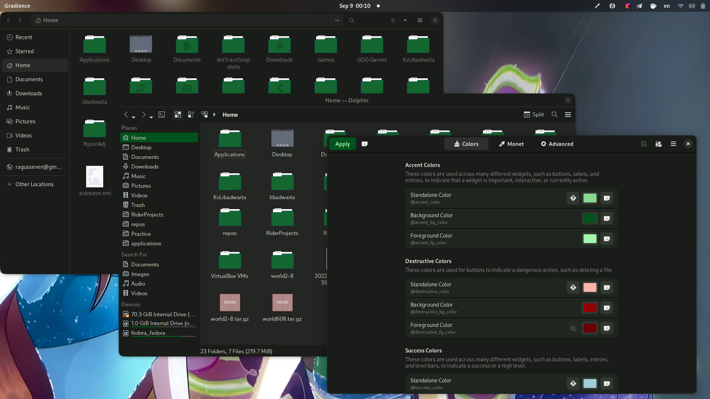
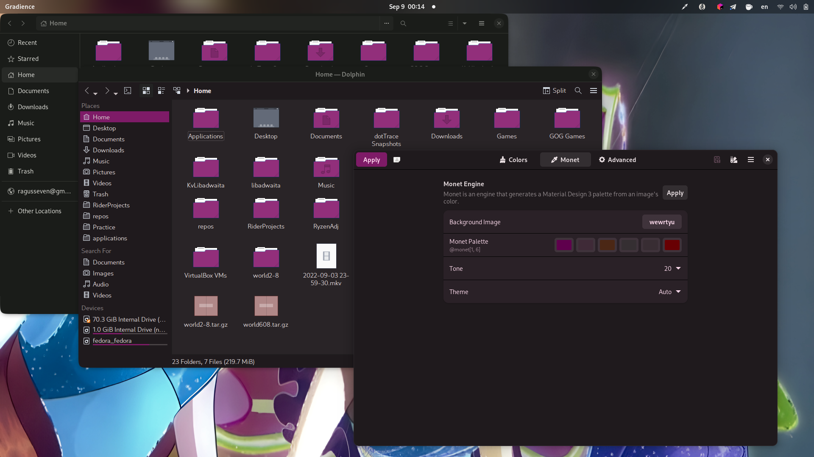

<h1>Gradience To Qt Theme Converter</h1>
This simple Python script can colorize Qt apps and some icon packs using color scheme defined in Gradience. It can be useful if you want to uniform look of Libadwaita and Qt apps in your GNOME desktop.
<h2>Requirements</h2>
adwaita-qt (by default in Fedora) 
qt5ct
<h2>Usage</h2>
1. Customize color scheme in Gradience. 
2. Apply this for GTK applications.  
3. Put icon packs and icons in ~/.icons if you want to colorize it  
4. Launch script.  
5. Open Qt5ct, choose Adwaita as theme and select Gradience as custom color scheme. 

<h2>Available Icon Packs</h2>
Breeze 
Tela 
Fluent 
Qogir 
Papirus 

<h2>Example</h2>

<h2>Roadmap</h2>
    Create Gradience plugin from this script. 
    Add better support of light themes 
